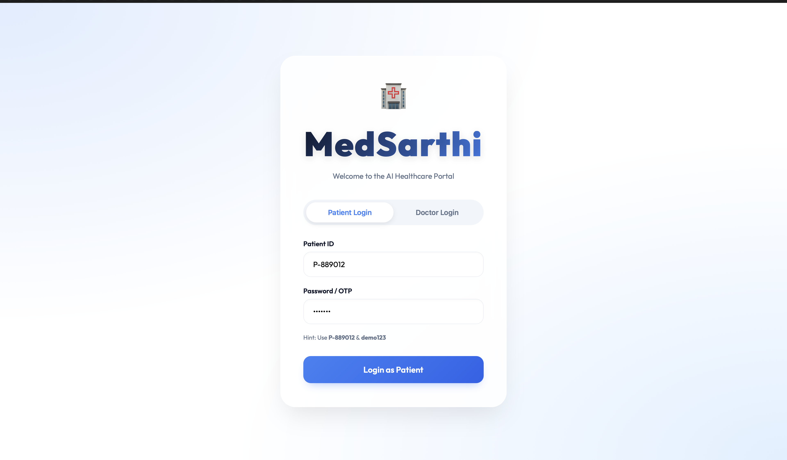
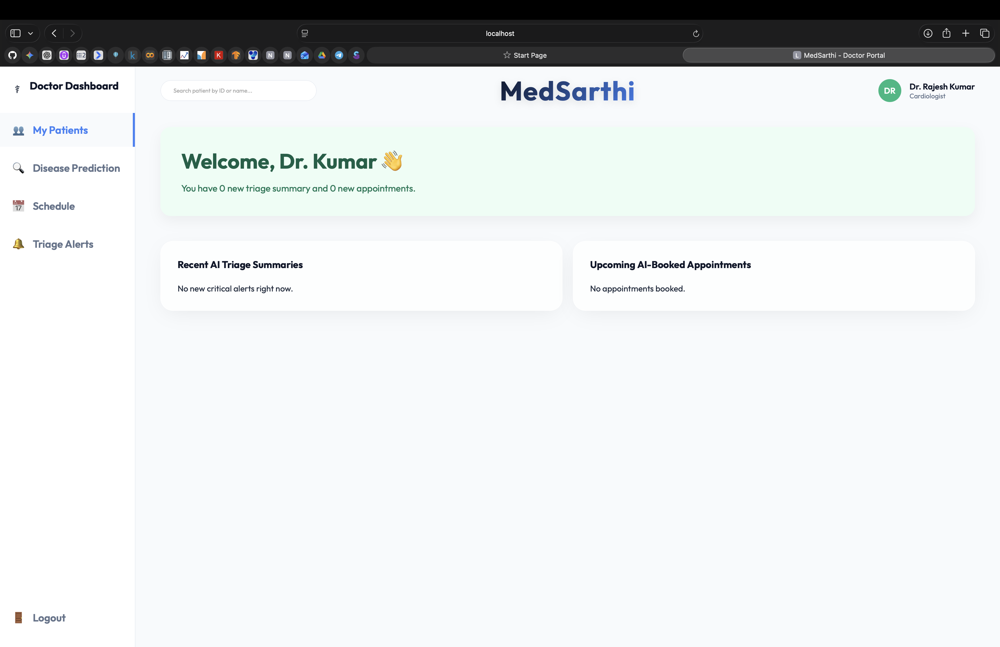
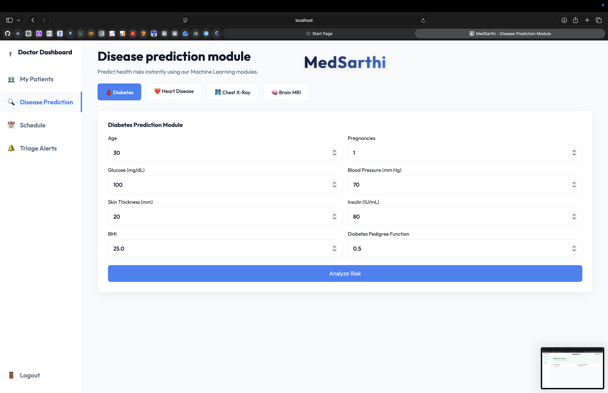
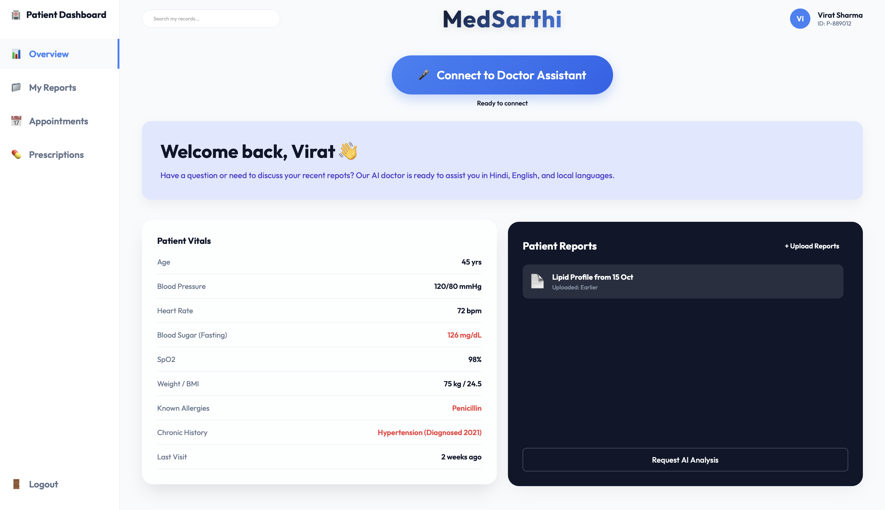

<div align="center">
  <h1>🏥 MedSarthi</h1>
  <p><strong>An intelligent, multi-indi-lingual AI assistant for Triage & Diagnostics</strong></p>
</div>

---

## � The Problem It Solves

Access to healthcare is often limited by **language barriers, overwhelmed clinics, and confusing medical jargon**. 
When a normal patient needs help, they face several roadblocks:
- Most digital health systems only operate in English.
- Clinics are overcrowded, causing massive delays just to speak with a triage nurse.
- Patients struggle to understand their medical reports or what diet and precautions they should follow.

## 💡 The MedSarthi Solution

**MedSarthi** is an intelligent medical infrastructure platform designed to bridge this gap. 

We provide an **advanced multilingual voice AI** that any patient can talk to, just like a real doctor! It natively understands and speaks multiple regional languages (like Hindi, Tamil, and English). 

**With a single tap on their smartphone or browser, a patient can:**
* 🗣️ **Have a real-time voice conversation** in their native language to explain how they are feeling.
* 🩺 **Get their symptoms diagnosed** and have their medical reports explained in simple words rather than complex jargon.
* 🥗 **Receive specific diet plans** and lifestyle precautions to help manage their ailment.
* 🏥 **Get routed instantly:** The AI assesses the urgency of the problem. If it is severe, the AI forwards the report and immediately hands the call off to a human doctor. If it is mild, the AI automatically books a routine hospital appointment for them.

## 🖼️ Application Gallery

<div align="center">
  <table style="width: 100%; border-collapse: collapse;">
    <tr>
      <td align="center" style="padding: 10px;">
        <strong>Patient Dashboard</strong><br>
        
      </td>
      <td align="center" style="padding: 10px;">
        <strong>Doctor Dashboard</strong><br>
        
      </td>
    </tr>
    <tr>
      <td align="center" style="padding: 10px;">
        <strong>Diagnostics Page</strong><br>
        
      </td>
      <td align="center" style="padding: 10px;">
        <strong>Login Portal</strong><br>
        
      </td>
    </tr>
  </table>
</div>

### 📺 Video Demonstration
[](doc_assets/dashboard_demo.mp4)

---

## 🚀 Key Features

### 🎙️ 1. Multilingual Voice Assistant
*   **One-Tap Call:** Direct browser-based voice interaction powered by **LiveKit WebRTC**.
*   **Indic Support:** Native-fidelity Speech-to-Text (STT) & Text-to-Speech (TTS) via **Sarvam AI**.
*   **OpenAI GPT-4o Brain:** Real-time reasoning, prescription explaining, and medical guidance.
*   **Safety Handoff:** Auto-transfers to human triage for emergencies (e.g., chest pain).

### 👨‍⚕️ 2. Doctor Dashboard
*   **Instant Triage:** AI-synthesized transcripts and severity alerts.
*   **Unified View:** Clean appointment and patient vitals management.

### 🔬 3. Diagnostic Predictors
*   **ML Engines:** Instant risk assessment for Diabetes and Heart Disease.
*   **X-Ray Analysis:** Deep Learning pipeline for pneumonia/chest health.

---

## 🛠️ Tech Stack

*   **Logic:** FastAPI (Python), LiveKit (WebRTC), OpenAI GPT-4o, Sarvam AI (Indic STT & TTS).
*   **ML/DL:** TensorFlow, Keras, Scikit-Learn.
*   **Frontend:** Vanilla JS, CSS3 (Glassmorphism), HTML5.

---

## ⚙️ Installation

### 1. Setup
```bash
git clone https://github.com/shivamMaurya14/MedSarthi.git
cd MedSarthi
python -m venv venv
source venv/bin/activate  # Windows: venv\Scripts\activate
pip install -r requirements.txt
```

### 2. Environment (`.env`)
```env
LIVEKIT_URL=wss://your-project-url.livekit.cloud
LIVEKIT_API_KEY=your_livekit_key
LIVEKIT_API_SECRET=your_livekit_secret
SARVAM_API_KEY=your_sarvam_key
OPENAI_API_KEY=your_openai_key
```

### 3. Run

You will need to run both the FastAPI backend and the LiveKit agent process simultaneously.

**Terminal 1 (Backend Web Server):**
```bash
uvicorn main:app --reload
```
Visit `http://localhost:8000` to access the dashboards.

**Terminal 2 (LiveKit Voice Agent):**
```bash
python agent.py dev
```

---

<div align="center">
  <i>"Redefining healthcare accessibility with scalable AI."</i><br>
</div>
